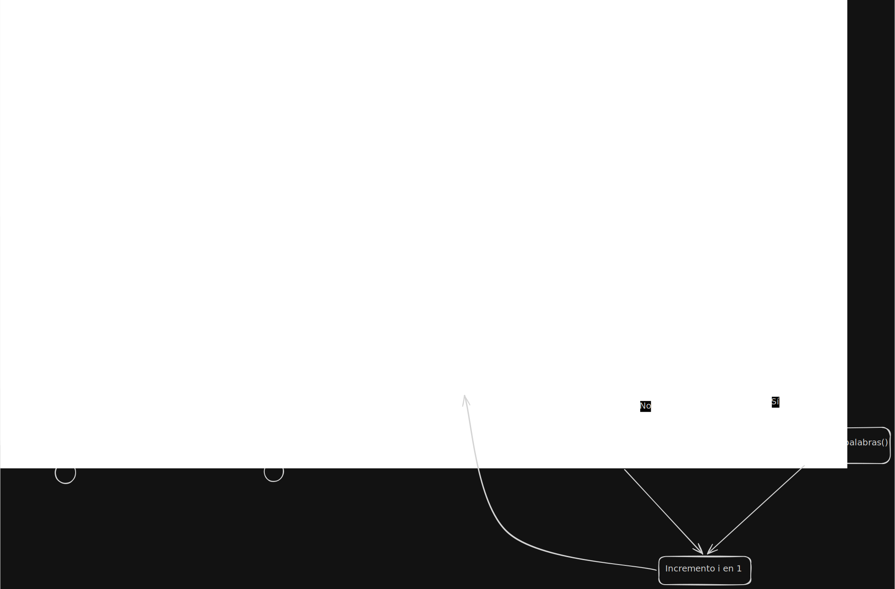
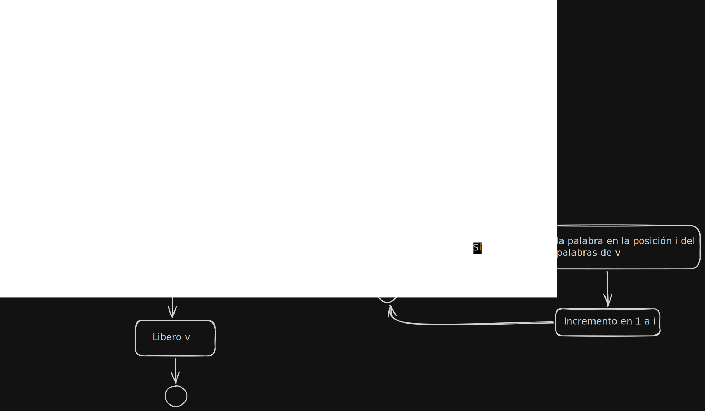
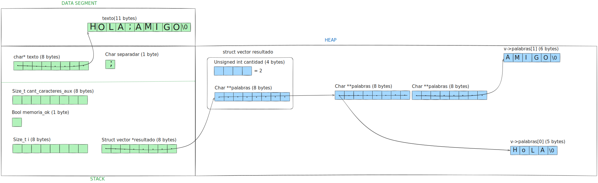
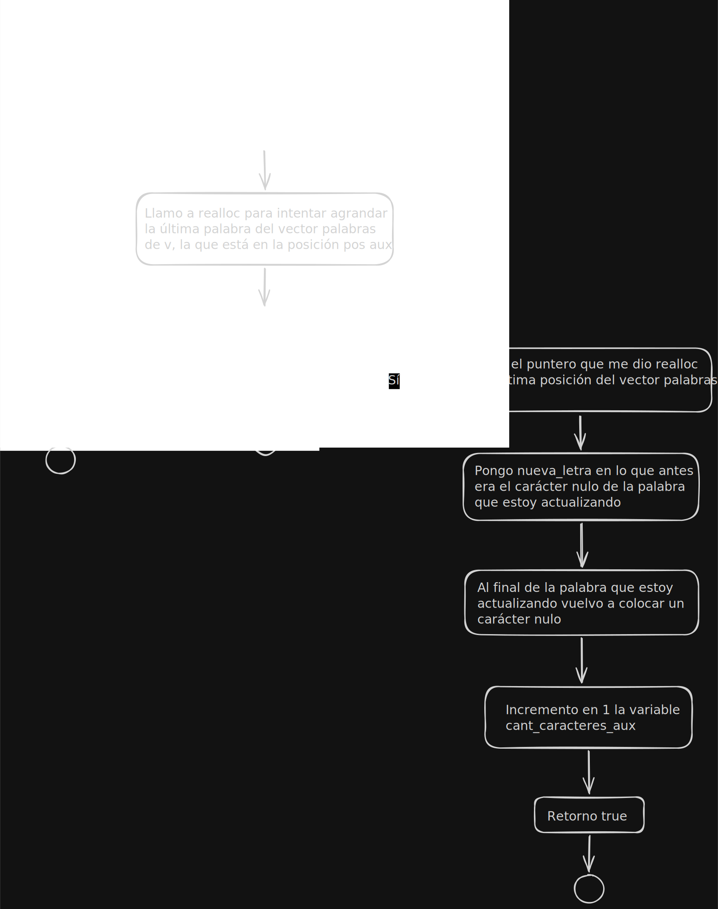
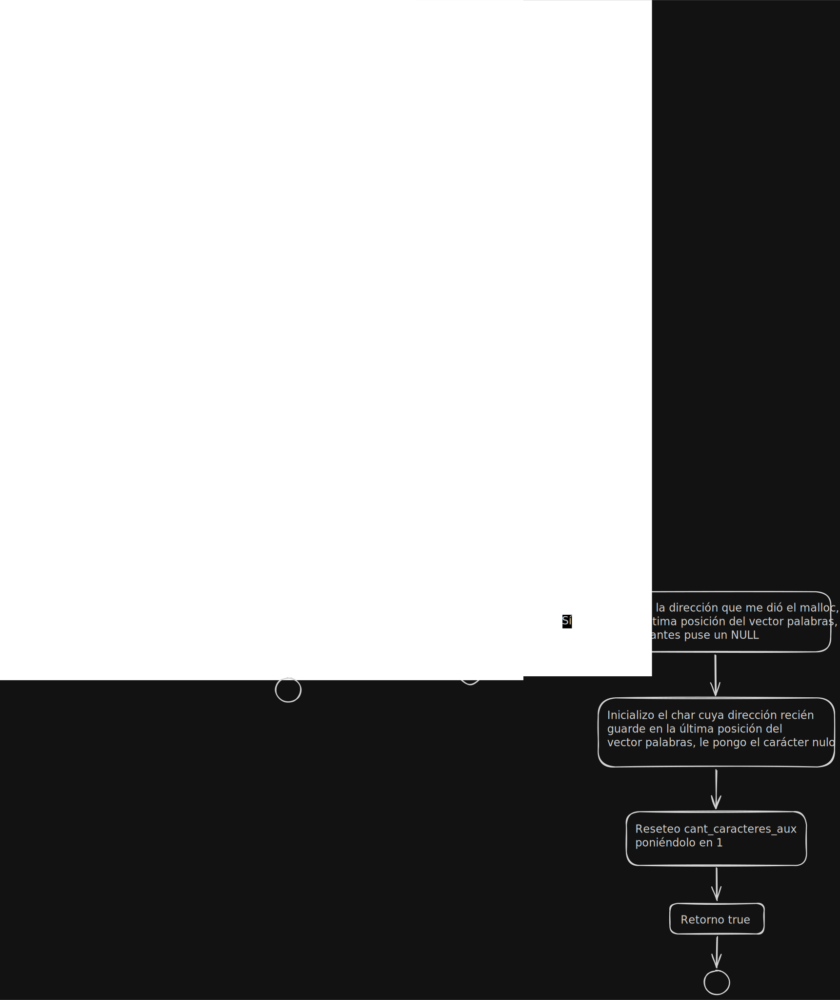
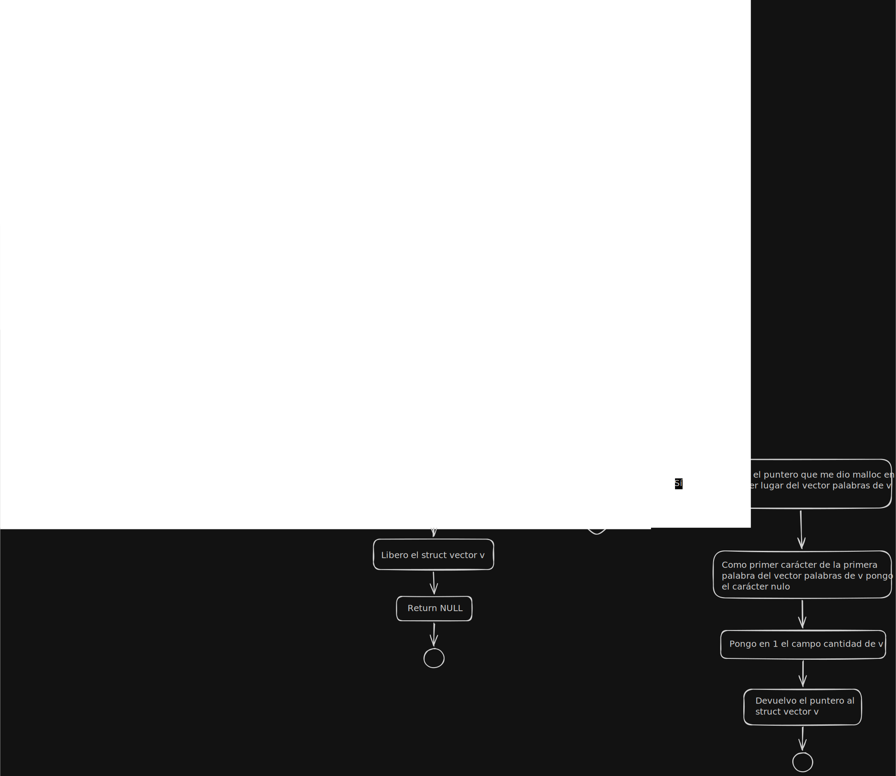

<div align="right">
    
</div>

# TP

## Información del estudiante

* Lautaro Jesús Duarte Vera
* 114088
* lautarojesussss@gmail.com (o lduartev@fi.uba.ar)

---

## Índice
* [1. Instrucciones](#1-Instrucciones)
  * [1.1. Compilar el proyecto](#11-Compilar-el-proyecto)
  * [1.2. Ejecutar las pruebas](#12-Ejecutar-las-pruebas)
  * [1.3. Ejecutar el programa con Valgrind](#13-Ejecutar-el-programa-con-Valgrind)
* [2. Funcionamiento](#2-Funcionamiento)
* [3. Estructura](#3-Estructura)
  * [3.1. Diagrama de memoria](#31-Diagrama-de-memoria)
* [4. Decisiones de diseño y/o complejidades de implementación](#4-Decisiones-de-diseño-yo-complejidades-de-implementación)
* [5. Respuestas a las preguntas teóricas](#5-Respuestas-a-las-preguntas-teóricas)

## 1. Instrucciones

### 1.1. Compilar el proyecto
```bash
make
```

### 1.2. Ejecutar las pruebas
```bash
make run
```

### 1.3. Ejecutar el programa con Valgrind
```bash
make valgrind
```

## 2. Funcionamiento
La función split toma un string cualquiera y un char, y se encarga de separar el texto 
original en strings más pequeños usando el char que recibió como punto de separación, los nuevos strings se colocan en un vector de strings dentro de un struct vector, en el orden que estaban escritos originalmente en el string más grande. 

<div align="center">
  
  <p>Diagrama de flujo de struct vector *split(char *texto, char separador).</p>
</div>


La función vector_destruir recibe un puntero a una instancia del struct vector y se encarga de liberar toda la memoria relacionada a esa instancia
<div align="center">
  
  <p>Diagrama de flujo de void vector_destruir(struct vector *v).</p>
</div>

## 3. Estructura

No armé nuevas estructuras para el tp, sólo use el struct vector que estaba el split.h

### 3.1. Diagrama de memoria
Este es un ejemplo de lo que tendría la memoria justo antes de hacer el return en la función split.c durante la prueba_1 (donde texto es "Hola;amigo" y el carácter separador es ';') si no hubo errores de memoria

<div align="center">
  
  <p>Diagrama de memoria de la estructura.</p>
</div>

## 4. Decisiones de diseño y/o complejidades de implementación

La mayor complejidad en el tp que fue controlar los errores de memoria de manera que si algo fallaba, a la hora de reservar memoria para una letra por ej, pudiese terminar liberando todo sin dejar algún bloque reservado suelto porque me olvidé de actualizar un contador o de cargar un puntero al struct vector etc. Fue complicado pensar el primer string que se carga al vector palabras, porque si no lo hacía como lo hice (inicializando minimamente el campo palabras del struct vector a la vez que se construye)tenía que hacer las funciones auxiliares adaptables a ese caso donde cantidad es cero y el primer string es el que tiene que ser creado desde cero etc, y se volvía menos entendible el código en mi opinión.

La primera vez que armé inicializar_vector también me olvidé de que tenía que reservar memoria para el char** en sí mismo también, no solo para el struct vector y para un char.

Originalmente la función split no estaba modularizada, y si bien no quedaba demasiado larga si sentí que era poco clara, especialmente cuando intenté hacer su diagrama de flujo, así que armé las dos funciones auxiliares, una para cuando se necesita agrandar solo una palabra ya existente y otra para cuando se necesita agregar otra palabra.

La función actualizar_palabra se encarga de agrandar la última palabra del vector palabras de v, colocarle la nueva letra a esa palabra y colocarle también el carácter nulo al final, además de actualizar un contador auxiliar de caracteres
<div align="center">
  
  <p>Diagrama de flujo de bool actualizar_palabra(struct vector *v, size_t *cant_caracteres_aux, char nueva_letra).</p>
</div>

La función agrandar_vector_palabras se encarga de reservar nueva memoria para agregar un char* al vector de palabras, y además reservar memoria para un carácter nulo que le cargamos automáticamente a esa nueva palabra, además incrementa el campo cantidad de v y vuelve a poner en 1 el contador de carácteres
<div align="center">
  
  <p>Diagrama de flujo de bool agrandar_vector_palabras(struct vector *v, size_t *cant_caracteres_aux).</p>
</div>

La función inicializar_vector se encarga de crear en el heap una instancia de struct vector e inicializar de forma minima sus campos
<div align="center">
  
  <p>Diagrama de flujo de struct vector *vector_inicializar().</p>
</div>

## 5. Respuestas a las preguntas teóricas


### 5.1. ¿Cómo funcionan los strings en C?
Los strings en C son simplemente vectores de char (un char* que apunta al primer char del string) que terminan con caracter nulo (\0)
todas las operaciones que se hacen con string.h funcionan copiando/comparando/moviendo/contando caracter a caracter teniendo el caracter nulo como tope para el vector.

### 5.2 ¿Cómo funcionan las primitivas malloc y free?
Malloc se usa para reservar memoria dinámica, un bloque contiguo de memoria dinámica especificamente, devuelve un puntero genérico, y solo le pasamos como argumento el tamaño, en bytes, del bloque que queremos reservar, si bien el puntero que devuelve es void podemos asignar el retorno del llamado a la función directamente a un tipo especifico de puntero, por ej char* o char** y se castea automáticamente,si por alguna manera no se puede reservar la memoria que pidió el usuario malloc retorna el puntero NULL

free sirve para liberar la memoria dinámica reservada con funciones como realloc, malloc y calloc, solo le pasamos el puntero al bloque de memoria dinámica y listo, no devuelve nada, si le pasamos el puntero NULL no se rompe nada, pero sí es un error pasarle un puntero colgante, o sea un puntero a memoria que ya fue previamente liberada, tampoco se le puede pasar un puntero que no apunte al heap porque genera comportamiento indeterminado.
